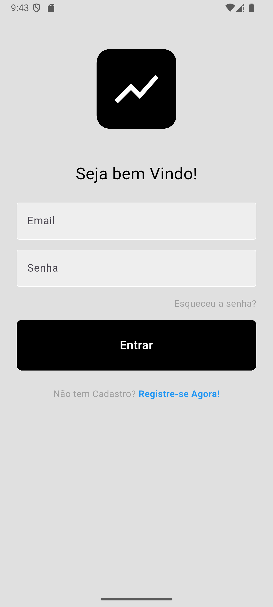
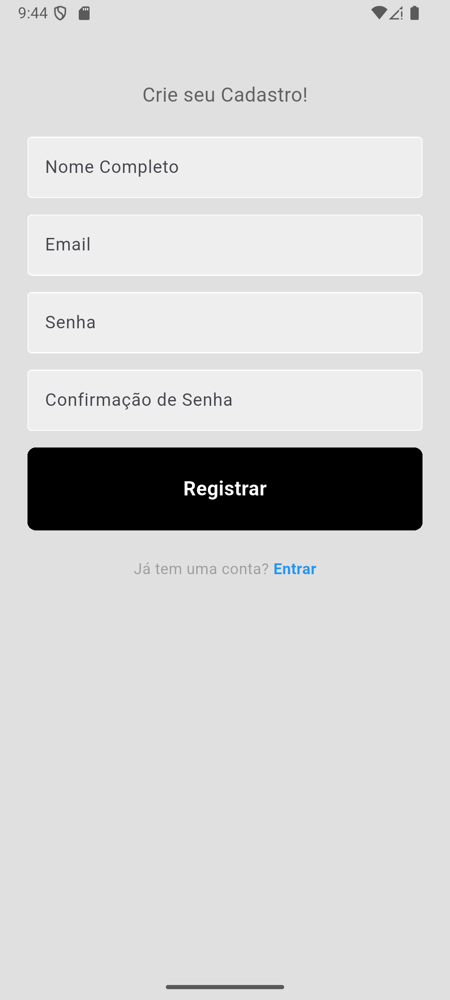
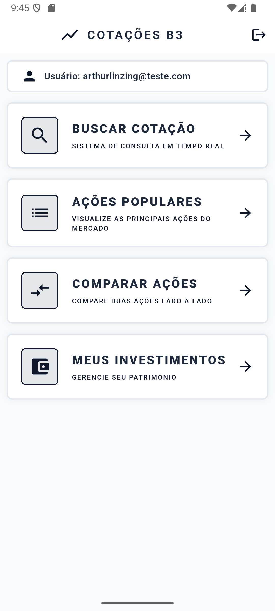
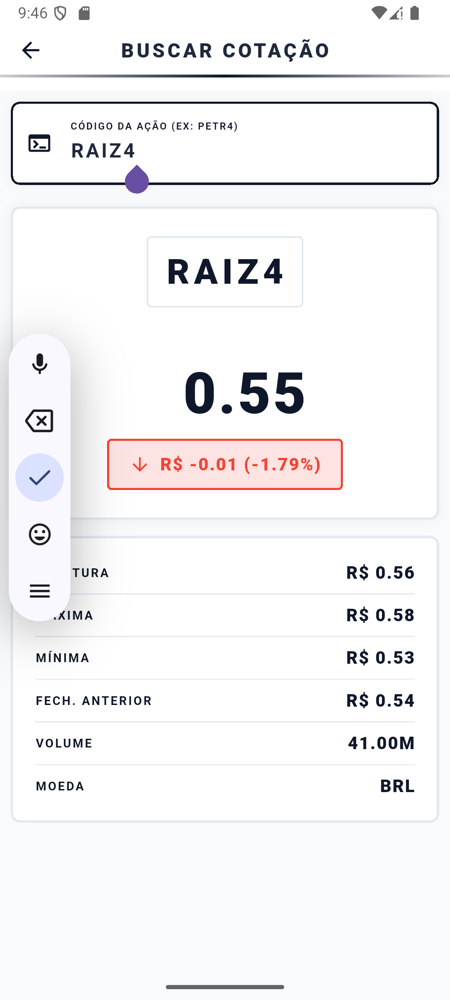
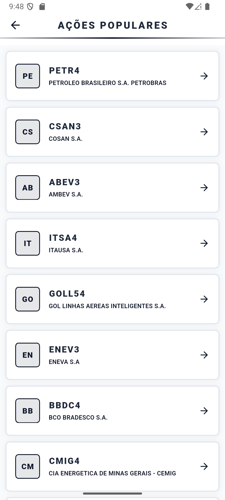
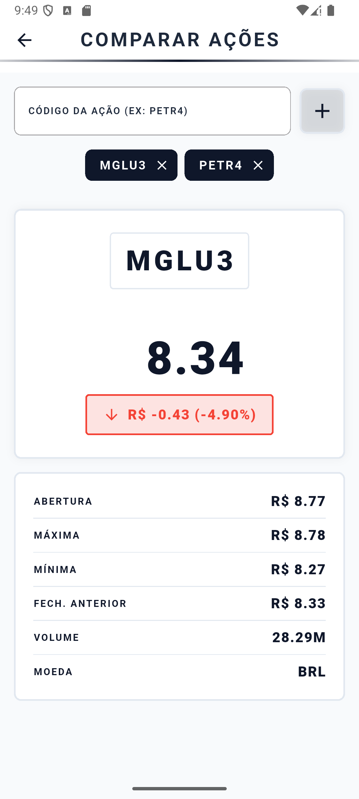
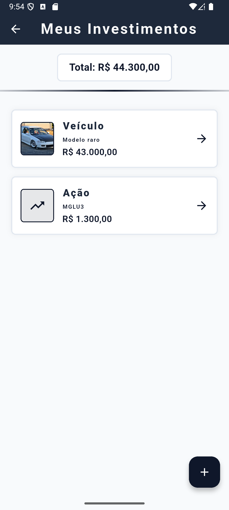
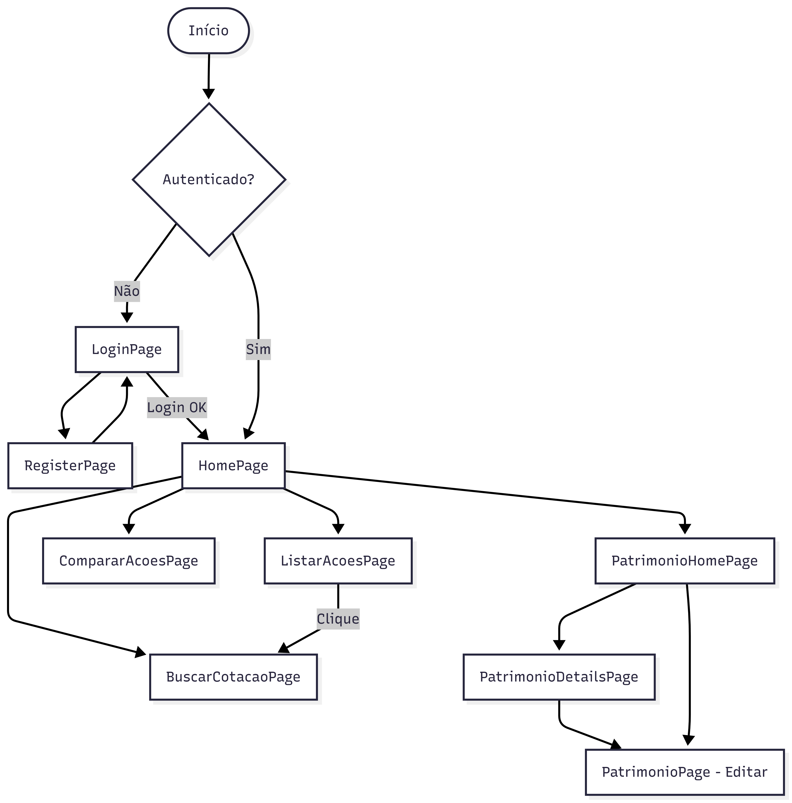

# 📈 Patrimônio & Investimentos

<div align="center">


*Aplicativo mobile para consulta de cotações da B3 e gestão de patrimônio pessoal.*

**Universidade Estadual do Centro-Oeste — UNICENTRO**

</div>

---

## 📌 Sobre

O **Patrimônio & Investimentos** é um aplicativo Flutter que integra a **API da BRAPI** para consultas em tempo real da bolsa de valores brasileira (B3) e o **Firebase Firestore** para gestão de patrimônio pessoal por usuário autenticado.

---

## 📱 Telas

### Login & Cadastro
| Login | Cadastro |
|-------|---------|
|  |  |

### Home & Cotações
| Home | Buscar Cotação |
|------|---------------|
|  |  |

### Ações & Patrimônio
| Ações Populares | Comparar Ações | Meus Investimentos |
|----------------|---------------|-------------------|
|  |  |  |

---

## ✨ Funcionalidades

| Funcionalidade | Descrição |
|----------------|-----------|
| 🔐 Autenticação | Login, cadastro e recuperação de senha via Firebase Auth |
| 🔍 Buscar Cotação | Consulta em tempo real de qualquer ação da B3 (ex: PETR4, VALE3) |
| 📋 Ações Populares | Lista as 50 ações mais negociadas por volume |
| ⚖️ Comparar Ações | Compara duas ações lado a lado deslizando a tela |
| 💼 Meus Investimentos | CRUD completo de patrimônio pessoal com foto e valor estimado |

---

## 🏗️ Arquitetura
```
📁 lib/
├── 📁 model/
│   └── patrimonio.dart
├── 📁 service/
│   ├── auth_service.dart       # Firebase Auth
│   ├── brapi_service.dart      # API de cotações
│   ├── firestore_service.dart  # CRUD Firestore
│   └── user_service.dart       # Dados do usuário
├── 📁 utils/
│   └── app_colors.dart
└── 📁 view/
    ├── 📁 components/
    │   ├── barra_tecnologica.dart
    │   ├── detalhes_cotacao_widget.dart
    │   ├── my_button.dart
    │   └── my_textfield.dart
    ├── auth_page.dart
    ├── home_page.dart
    ├── login_page.dart
    ├── register_page.dart
    ├── buscar_cotacao_page.dart
    ├── listar_acoes_page.dart
    ├── comparar_acoes_page.dart
    ├── Patrimonio_Home_Page.dart
    ├── patrimonio_page.dart
    └── patrimonio_details_page.dart
```

---

## 🔄 Fluxo do App


---

## ⚙️ Tecnologias

| Tecnologia | Uso |
|------------|-----|
| Flutter | Framework mobile |
| Dart | Linguagem |
| Firebase Auth | Autenticação de usuários |
| Cloud Firestore | Banco de dados em nuvem |
| BRAPI | API de cotações da B3 |
| Dio | Cliente HTTP |

---

## 🚀 Como Executar

**Pré-requisitos:** Flutter SDK, Android Studio ou VS Code, e um projeto Firebase configurado.

**1. Clone o repositório**
```bash
git clone https://github.com/CarboniArt/trabalho-final-interface.git
cd patrimonio_investimentos
```

**2. Instale as dependências**
```bash
flutter pub get
```

**3. Configure o Firebase**

Adicione o arquivo `google-services.json` (Android) na pasta `android/app/` e o `GoogleService-Info.plist` (iOS) na pasta `ios/Runner/`.

**4. Execute o app**
```bash
flutter run
```

---

## 👨‍💻 Autor

<table>
  <tr>
    <td align="center">
      <a href="https://github.com/CarboniArt">
        <br/>
        <sub><b>Arthur Linzing</b></sub>
      </a>
    </td>
  </tr>
</table>

---
 
<div align="center">
  <sub>Universidade Estadual do Centro-Oeste (UNICENTRO)</sub>
</div>